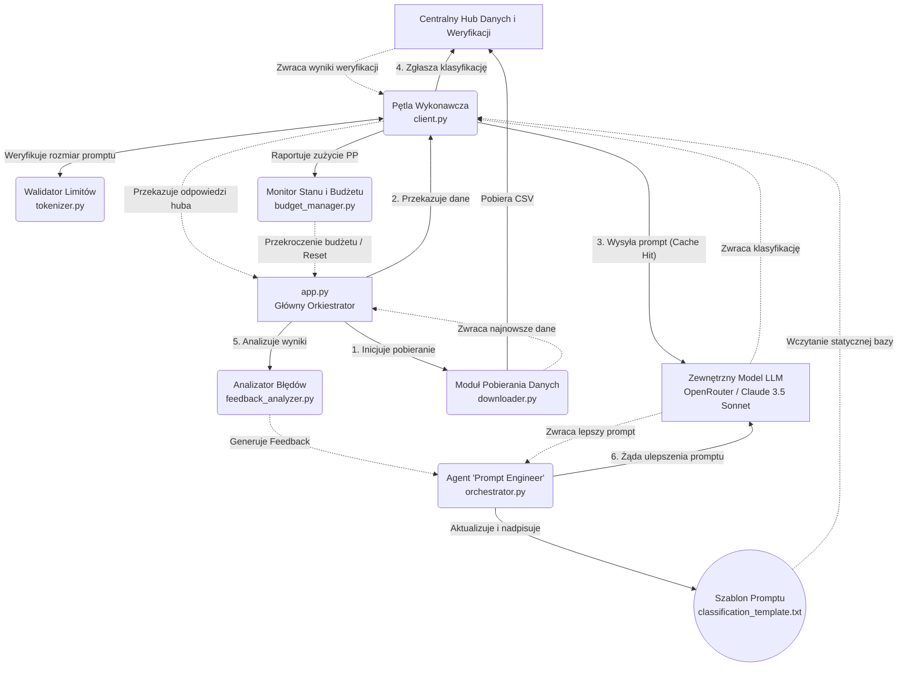

# Serwer MCP - Klasyfikacja Towarów

Projekt implementuje architekturę serwera MCP (Model Context Protocol) przeznaczonego do ciągłej, zautomatyzowanej klasyfikacji towarów na podstawie ich opisów. System integruje się z zewnętrznym hubem dostarczającym dane, wykorzystuje LLM (przez OpenRouter) do klasyfikacji, oraz posiada mechanizm samodoskonalenia (Prompt Engineering) na podstawie analizy błędów.

---

## 🏗️ Schemat Architektury Systemu



> *(Powyższy schemat można wyrenderować używając rozszerzeń obsługujących format **Mermaid**, np. na GitHubie lub w VS Code.)*

---

## ⚙️ Opis Funkcji Poszczególnych Elementów

System został podzielony na wysoce wyspecjalizowane moduły, z których każdy odpowiada za jedno konkretne zadanie. Poniżej znajduje się szczegółowy opis ich funkcji:

### 1. 📥 Moduł Pobierania Danych (Data Ingestion)
- **Lokalizacja:** `src/data_ingestion/downloader.py`
- **Funkcjonalność:** Działa jako punkt wejścia dla najnowszych informacji. Przed każdą serią klasyfikacji pobiera świeżą wersję pliku CSV z huba. Używa biblioteki `pandas` do szybkiego parsowania pliku wprost z pamięci do wygodnych list słowników (id, description), ignorując zbędne narzuty I/O.

### 2. 🧠 Agent "Prompt Engineer" (Orkiestrator)
- **Lokalizacja:** `src/prompt_engineering/orchestrator.py`
- **Funkcjonalność:** Jest "inteligentnym" sercem systemu. Wykorzystuje zewnętrzny, zaawansowany model (Claude 3.5 Sonnet). Otrzymuje spreparowany feedback z błędnymi decyzjami z poprzedniej rundy i ma za zadanie przeanalizować powód błędu. Jego jedynym wynikiem pracy jest zwrócenie nowej, udoskonalonej i nadpisanej wersji głównego szablonu `classification_template.txt`, po to aby zapobiec błędom w kolejnej iteracji.

### 3. 💾 Mechanizm Optymalizacji Cache (Prompt Caching)
- **Lokalizacja:** Logika w `client.py` korzystająca z pliku `prompts/classification_template.txt`
- **Funkcjonalność:** Kluczowa funkcja minimalizująca wydatki (zmniejszenie z 0.02 PP do 0.01 PP za 10 tokenów). Szablon przechowuje wszystkie zasady działania po angielsku i jest *zawsze stały na początku każdego wysyłanego zapytania*. Zmienne dane dla konkretnego towaru (ID i opis) są dodawane jako suffix. Dzięki temu model na OpenRouter cache'uje początek zapytań dla całej pętli wykonawczej.

### 4. 🔄 Pętla Wykonawcza (Execution Loop)
- **Lokalizacja:** `src/hub_communication/client.py`
- **Funkcjonalność:** "Mięśnie" systemu. Rozkłada zadanie na 10 oddzielnych zapytań do API huba. Odbiera główny szablon, wstrzykuje na jego sam dół dane dla pojedynczego towaru, wysyła przygotowany pakiet do LLM po werdykt klasyfikacyjny, a następnie strzela metodą POST bezpośrednio do API huba zgłaszając wynik. Zbiera wszystkie odpowiedzi zwrotne w jedną listę.

### 5. ⏱️ Walidator Limitów (Tokenizer)
- **Lokalizacja:** `src/validation/tokenizer.py`
- **Funkcjonalność:** Strażnik wielkości. Bezpośrednio przed opuszczeniem systemu i wysłaniem zapytania do LLM, weryfikuje długość połączonego łańcucha znaków (szablon + dane dynamiczne) przy pomocy biblioteki `tiktoken`. Jeśli zapytanie przekracza 100 tokenów, zablokuje je informując system, co chroni przed błędami limitów i zrzuceniem odpowiedzi przez serwery odbierające.

### 6. 💰 Monitor Stanu i Budżetu (State & Budget Manager)
- **Lokalizacja:** `src/state_management/budget_manager.py`
- **Funkcjonalność:** Strażnik zasobów (PP). Systematycznie i na bieżąco monitoruje koszt poszczególnych akcji w systemie. Posiada mechanizm bezpieczeństwa "hard limit" ustawiony na np. 1.5 PP. Gdy system zbliża się do tego progu z powodu kolejnych prób i modyfikacji, budżet menedżer podnosi flagę ostrzegawczą i resetuje proces huba lub aplikację.

### 7. 🔍 Analizator Błędów (Feedback Loop)
- **Lokalizacja:** `src/analysis/feedback_analyzer.py`
- **Funkcjonalność:** Moduł ten analizuje "surowe" JSONy zwrócone przez huba po próbach klasyfikacji. Odfiltrowuje odpowiedzi pozytywne (sukcesy), zbierając jedynie te, dla których model zwrócił błąd. Normalizuje i strukturyzuje je w format czysto tekstowy, który jest bardzo łatwo zrozumiały przez agenta `Prompt Engineer`.

### 8. 🛡️ Logika Obsługi Wyjątków na Poziomie Promptu
- **Lokalizacja:** `prompts/classification_template.txt`
- **Funkcjonalność:** Zbiór rygorystycznych, bazowych praw zapisanych wprost w prompcie systemowym dla modelu LLM. Tłumaczy sposób zachowania i klasyfikowania zjawisk fizycznych (NEU i DNG). To w nim ukryta jest główna reguła biznesowa nadpisująca standardową dedukcję: *CRITICAL OVERRIDE – klasyfikuj wszystkie elementy reaktora jako neutralne bez względu na kontekst.*

---

## 🚀 Jak Uruchomić
1. Upewnij się, że posiadasz uzupełniony plik `../.config` ze zmiennymi (`OPENROUTER_API_KEY`, `HUB_API_KEY`, etc.). Zmienne środowiskowe pobierane są z głównego konfigu projektu, by zachować unifikację.
2. Stwórz środowisko wirtualne i zainstaluj wymagania środowiskowe z pliku `requirements.txt`.
   ```bash
   python -m venv .venv
   source .venv/bin/activate  # (lub .venv\Scripts\activate w systemie Windows)
   pip install -r requirements.txt
   ```
3. Uruchom proces główny poleceniem: 
   ```bash
   python app.py
   ```